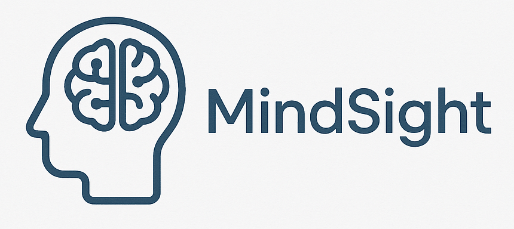
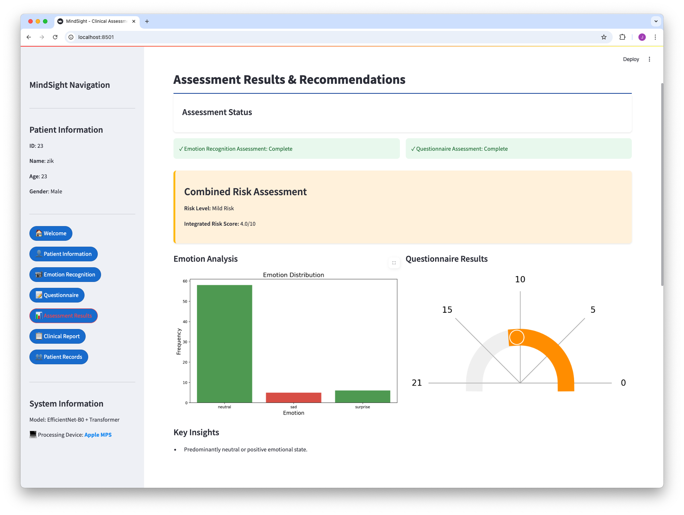

# MindSight: Facial Emotion Recognition for Mental Health Assessment



## Overview

MindSight is an advanced AI-powered application that combines facial emotion recognition technology with standardized psychological assessments to provide comprehensive mental health insights. Using a deep learning model architecture based on EfficientNet-B0 with Transformer layers, the system can detect and analyze seven basic emotions in real-time: anger, disgust, fear, happiness, neutral, sadness, and surprise.

## Key Features

- **Real-time Emotion Detection**: Process webcam feed to identify facial expressions and emotional states
- **Mental Health Assessment**: Integrates emotional analysis with standardized psychological questionnaires including PHQ-9 (depression) and GAD-7 (anxiety)
- **Clinical Dashboard**: Professional UI designed for healthcare practitioners
- **Comprehensive Reporting**: Generates detailed assessment reports with visualizations
- **Containerized Deployment**: Easily deploy with Docker in various environments

## Screenshots


*The clinical dashboard provides an intuitive interface for practitioners*


*The assessment interface combines real-time emotion recognition with psychological questionnaires*

## Technical Details

### Architecture
- **Model**: EfficientNet-B0 backbone with custom Transformer blocks
- **Training**: Cross-validation, data augmentation, and oversampling techniques
- **Performance**: As for now, we achieved ~67% accuracy on the 7-class emotion classification task. We are still experimenting with the training pipeline to achieve the best result.
- **Inference**: Real-time processing with support for CPU and GPU/MPS hardware acceleration

### Tech Stack
- **Frontend**: Streamlit for interactive web interface
- **Backend**: Python 3.9+, PyTorch 2.0+
- **Computer Vision**: OpenCV for real-time video processing
- **Containerization**: Docker for consistent deployment
- **Visualization**: Matplotlib, Seaborn, Plotly for data visualization

## Getting Started

### Option 1: Using Docker
```bash
# Clone the repository
git clone https://github.com/p1sangmas/MindSight.git
cd MindSight

# Start the application with Docker
./start.sh

# Access the dashboard at http://localhost:8501
```

### Option 2: Local Installation (Recommended for webcam functionality)
```bash
# Clone the repository
git clone https://github.com/p1sangmas/MindSight.git
cd MindSight

# Create and activate virtual environment
python -m venv env
source env/bin/activate  # On Windows: env\Scripts\activate

# Install dependencies
pip install -r requirements.txt

# Run the application
streamlit run src/dashboard_app.py
```

## Camera Configuration

For optimal webcam performance, please note:
- OpenCV is used for webcam capture
- When running in Docker, camera device mapping must be properly configured
- Browser permissions must be granted for camera access
- See `webcam-setup.md` for detailed instructions for your specific OS

## Training Custom Models

The project includes scripts for training custom emotion recognition models:

```bash
# Train with default parameters
python src/train.py --data_dir data

# Train with custom configurations
python src/train.py --data_dir data --model_folder my_custom_model --num_epochs 50 --batch_size 32
```

## Evaluation

```bash
# Evaluate a trained model
python src/evaluate.py --model_path checkpoints/model_name/best_model.pth
```

## Project Structure
```
├── src/                  # Source code
│   ├── model.py          # Model architecture definition
│   ├── train.py          # Training pipeline
│   ├── evaluate.py       # Evaluation script
│   ├── dashboard_app.py  # Streamlit dashboard application
│   ├── dashboard_utils.py # Utilities for the dashboard
│   ├── questionnaire.py  # Psychological assessment questionnaires
│   └── data_preprocessing.py # Data preprocessing utilities
├── data/                 # Training and testing datasets
├── checkpoints/          # Saved model weights
├── runs/                 # TensorBoard logs
├── imgs/                 # Images and screenshots
└── docker-compose.yml    # Docker configuration
```

## Troubleshooting

If you're having issues with camera access:

1. **Browser Permissions**:
   - Check that your browser has permission to access your camera
   - Try using Chrome or Firefox (they have better webcam support)
   - Look for the camera icon in your browser's address bar

2. **Docker-specific issues**:
   - Browser-based camera access requires explicit permission
   - If the permission dialog doesn't appear, try clicking the "Request Camera Permission" button
   - See the Docker configuration in docker-compose.yml for your specific OS

## License

This project is licensed under the MIT License. See the LICENSE file for details.

---

**Developed by Fakhrul Fauzi, Zikry Zaharudin and Saiful Azree**
